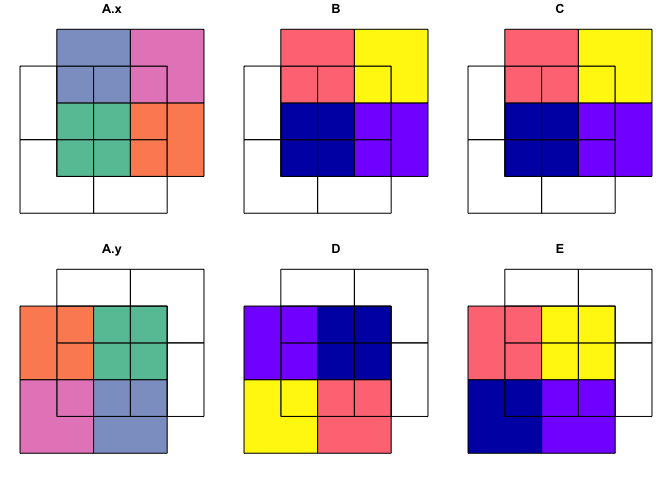

# sfhelpers

## Purpose

`sfhelpers` is a R package including functions helping to run routines
related primarily to simple features
([`sf`](https://cran.r-project.org/web/packages/sf/index.html)) , but
also to spatial objects of other classes / packages (
[`raster`](https://cran.r-project.org/web/packages/raster/index.html),
[`sp`](https://cran.r-project.org/web/packages/sp/index.html),
[`stars`](https://cran.r-project.org/web/packages/stars/index.html) ).
`sfhelpers` is motivated by multiple requests for code or advice related
to `sf`. By publishing `sfhelpers` I hope to at least partly satisfy
these demands. `sfhelpers` is still very much in the development phase;
it may or may not go any further. Suggestions are welcome.

## Installation

``` r
# install package devtools if not yet installed
# install.packages("devtools")

# install fast from GitHub without vignettes (not recommended)
#   devtools::install_github("a-benini/sfhelpers")

# recommended: installation from GitHub including vignettes:
 pkgs_4_vignettes <- c("magrittr", "dplyr")
 # packages required to build sfhelpers's vignettes from GitHup repository
 new_pkgs_4_vignettes <- pkgs_4_vignettes[!pkgs_4_vignettes %in% installed.packages()]
 # among these packages the ones not yet installed
 if(length(new_pkgs_4_vignettes) > 0){install.packages(new_pkgs_4_vignettes)}
 # install the still missing packages
 devtools::install_github("a-benini/sfhelpers", build_vignettes = TRUE)
 # install sfhelpers from GitHup with its vignettes
```

## Usage

``` r
library(sfhelpers)
#> Registered S3 methods overwritten by 'stars':
#>   method             from
#>   st_bbox.SpatRaster sf  
#>   st_crs.SpatRaster  sf
```

## Usage Example

`sfhelpers::st_or` is a `sf` equivalent of QGIS Union. `st_or` returns a
geometry set containing overlapping and non-overlapping parts of two
input `sf` objects (or `sfc`s).

``` r
library(sf)
#> Linking to GEOS 3.9.1, GDAL 3.3.2, PROJ 8.1.1
library(sfhelpers)

# the two included demo sf-objects have partly identically named attribute columns
st_agr(poly_1)
#>    A    B    C 
#> <NA> <NA> <NA> 
#> Levels: constant aggregate identity
st_agr(poly_2)
#>    A    D    E 
#> <NA> <NA> <NA> 
#> Levels: constant aggregate identity

# st_or() suffixes by default originally identically named attribute columns
st_or(x = poly_1, y = poly_2) %>% st_drop_geometry()
#> Warning: attribute variables are assumed to be spatially constant throughout all
#> geometries
#>      A.x  B    C  A.y  D    E
#> 1     Pq  1 1983    z 48 2015
#> 1.1   Pq  1 1983    y 36 2016
#> 2     Qr  2 1984    y 36 2016
#> 1.2   Pq  1 1983    x 24 2017
#> 3     Rs  3 1985    x 24 2017
#> 1.3   Pq  1 1983    w 12 2018
#> 2.1   Qr  2 1984    w 12 2018
#> 3.1   Rs  3 1985    w 12 2018
#> 4     St  4 1986    w 12 2018
#> 22    Qr  2 1984 <NA> NA   NA
#> 32    Rs  3 1985 <NA> NA   NA
#> 41    St  4 1986 <NA> NA   NA
#> 11  <NA> NA   NA    z 48 2015
#> 21  <NA> NA   NA    y 36 2016
#> 31  <NA> NA   NA    x 24 2017

st_or(poly_1, poly_2) %>% plot()
#> Warning: attribute variables are assumed to be spatially constant throughout all
#> geometries
```



For the rest of the functions included in `sfhelpers` see
[here](https://a-benini.github.io/sfhelpers/reference/index.html).
